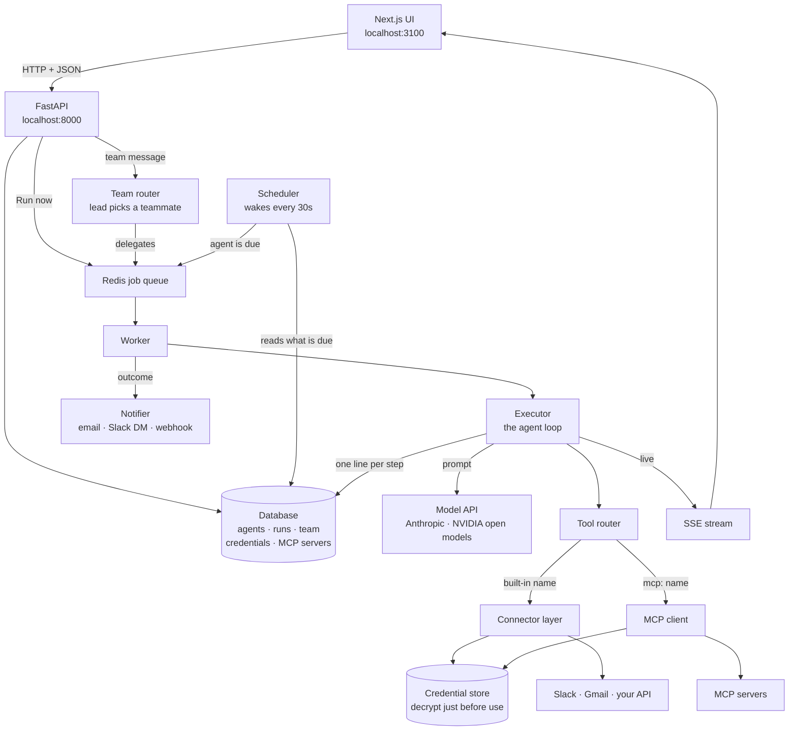
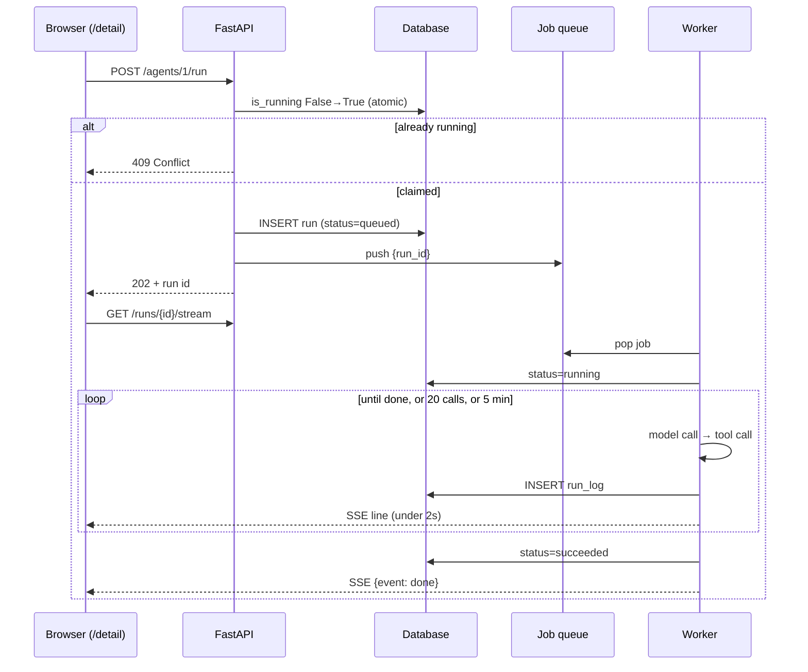
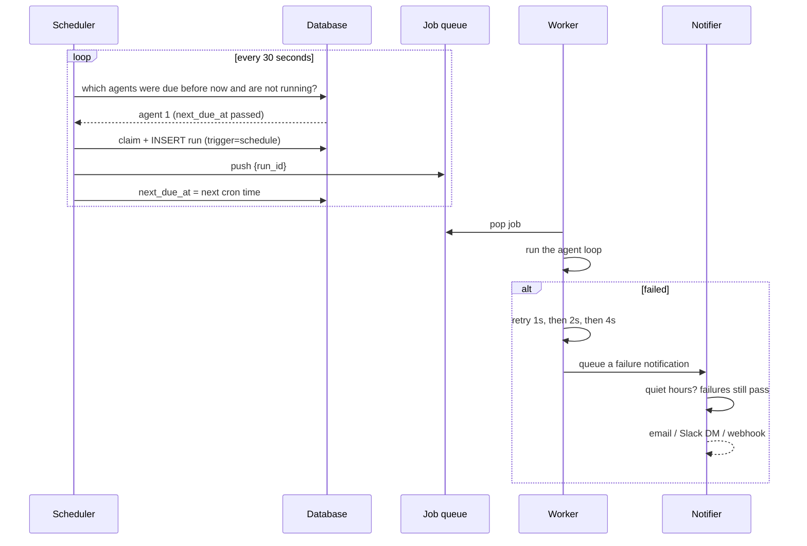
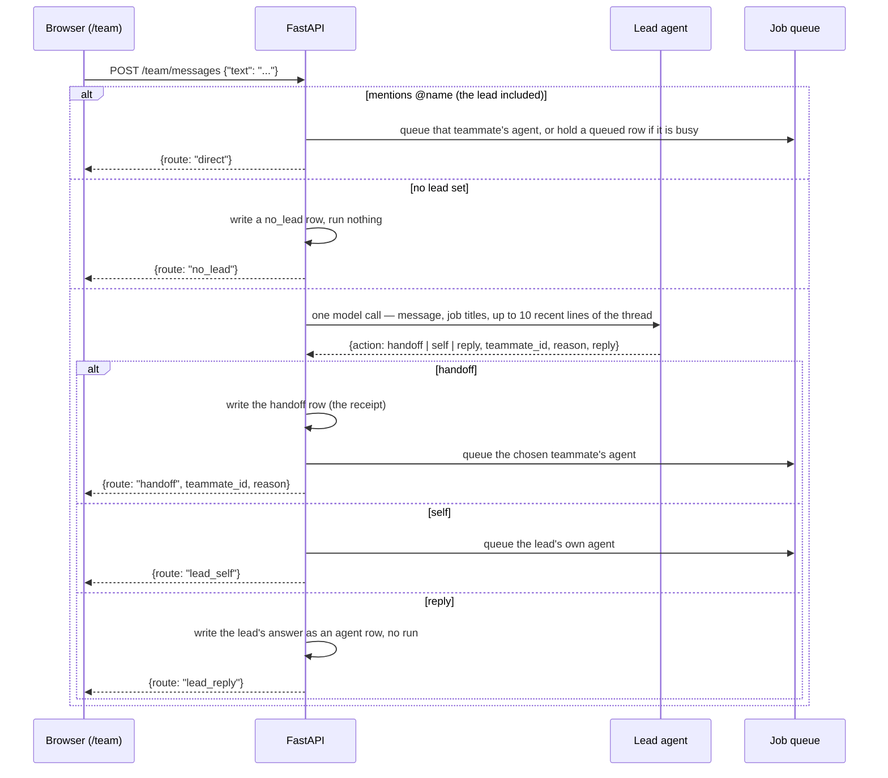

# Flow — how the frontend and the backend act together

Two separate programs, one HTTP boundary.

| | Frontend | Backend |
|---|---|---|
| Runs on | `localhost:3100` (Next.js) | `localhost:8000` (FastAPI) |
| Owns | screens, forms, the thread as you type it | agents, runs, credentials, schedules |
| Started by | `npm run dev` | `./scripts/dev.sh` |
| Processes | 1 | 4 — API, scheduler, worker, notifier |

The frontend never calls Gmail, Slack, or a model. It calls the backend; the backend
holds every credential and makes every outside call.

---

## 1. The shape of the whole system



**Why four processes, not one.** The scheduler only decides *what* is due, so it can
never get stuck. The workers do the slow part and are the only thing you scale. The
notifier talks to a mail provider that may be slow, and that must never hold up a run.

---

## 2. Three ways a run starts

All three end at the same place: a job on the queue, with the agent already flagged
as running so nothing can queue it twice.

### 2a. The user presses "Run now"



### 2b. The schedule fires, with nobody watching



### 2c. A message to the team



The lead gets **no tools**, so a wrong pick costs one cheap run and can never cause a
side effect. The id it returns is checked against the roster before anything runs, and
when the model is down or names nobody real, a keyword backstop routes work and
otherwise answers with who does what — it never starts a run on a guess.

When the run finishes, the worker writes the teammate's answer into the thread
*before* releasing the agent's lock, then starts the oldest `queued` message waiting
for that teammate, if any. The agent's user turn (`app/team/context.py`) carries its
name and job title, the roster, and the recent transcript, so the reply reads as part
of the conversation.

---

## 3. Which screen calls which endpoint

The frontend routes already exist; these are the calls to wire into each.

| Frontend route | Calls | Purpose |
|---|---|---|
| `/today` | `GET /stats?range=today\|7d\|30d` | Every tile, chart, and ring |
| `/agents` | `GET /agents` · `DELETE /agents/{id}` | The table |
| `/create` | `GET /connections/tools` · `POST /agents` | Tool list, then save (402 past the cap) |
| `/detail` | `GET /agents/{id}` · `GET /agents/{id}/runs` · `GET /runs/{id}/logs` · `GET /runs/{id}/stream` · `POST /agents/{id}/run` | Detail, history, live log, Run now |
| `/chat` | `POST /builder/draft` | Plain words → a draft the form opens |
| `/team` | `GET /team` · `GET /team/messages` · `POST /team/messages` · `PUT /team/lead` | Roster, thread, lead |
| `/mate` | `GET /agents` · `POST /team/teammates` | Pick an agent, name it |
| `/connections` | `GET/POST/DELETE /connections` · `GET/POST /mcp-servers` | Apps and MCP servers |
| `/notifications` | `GET /notifications` · `POST /notifications/read-all` · `GET/PUT /notifications/prefs` | Feed, quiet hours |

`/detail` is currently hard-coded to one agent; it becomes `/agents/[id]` when wired.

---

## 4. Where the limits live

| Limit | Value | Enforced in |
|---|---|---|
| Scheduler tick | 30s | `scheduler/ticker.py` |
| Scheduled run starts within | 60s of due | tick interval |
| Run wall clock | 5 min | `runtime/executor.py` |
| Tool calls per run | 20 | `runtime/executor.py` |
| One tool call | 30s, then cancelled | `runtime/router.py` |
| Retries | 3 · 1s / 2s / 4s | `runtime/runs.py` |
| Log line reaches the browser | under 2s | `runtime/logger.py` → SSE |
| Agents per user | 5 → HTTP 402 | `api/agents.py` |
| Same agent twice at once | refused → HTTP 409 | `runtime/runs.py` |

---

## 5. Two rules that hold everywhere

**Credentials.** Encrypted before they are written, decrypted in memory only in the
moment before a tool call. Four kinds share one store: OAuth tokens, API keys, custom
HTTP headers, and MCP bearer tokens.

**Ownership.** Every query for a user-owned row goes through `security/ownership.py`,
which adds `WHERE user_id = me`. Another user's id returns 404, never 403, so ids
cannot be probed. This is a database rule, not something the UI hides.

---

## 6. Running it

```bash
# backend — API, scheduler, worker, notifier
cd backend && ./scripts/dev.sh          # → localhost:8000/docs

# frontend
npm run dev                             # → localhost:3100
```

Every default model is `nemotron-3-super` on NVIDIA (`NVIDIA_API_KEY`), with
thinking off (`NVIDIA_THINKING=false`) so a run lands in 3–7 s. `MODEL_PROVIDER=fake`
replays canned turns for tests; `anthropic` (+ `ANTHROPIC_API_KEY`) for Claude. An
agent whose `model` is an NVIDIA name routes there whatever the provider setting.

Tools are real: Gmail and Slack call their APIs with the user's token. Nothing is
connected until the user connects it — paste a token on the Connections screen, or
set `GOOGLE_CLIENT_ID/SECRET` or `SLACK_CLIENT_ID/SECRET` and use Sign in. A run
that needs a missing connection gets `Blocked: … is not connected` as its tool
result and says so; a team message to such a teammate writes a `blocked` row.

Postgres and Redis come from `docker compose up -d`; set a
`sqlite+aiosqlite://` URL to run with no Docker at all.
